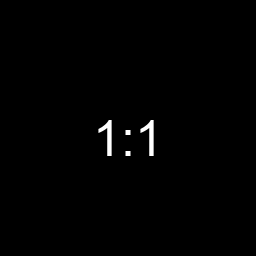
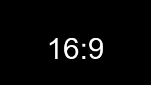
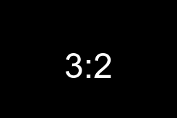
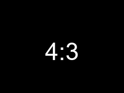
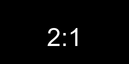
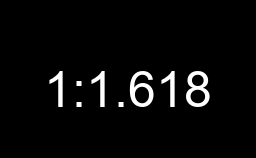
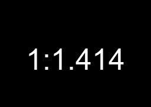
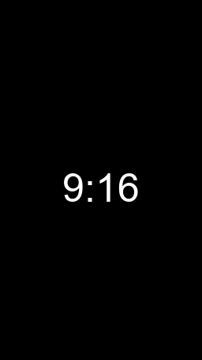
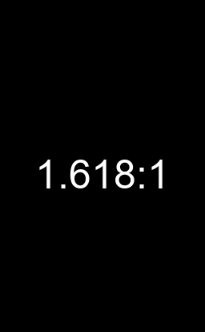

# アスペクト比計算

## インストール
```
pip install git+https://github.com/massao000/aspect_ratio
```

## 使い方

```python
import aspect_ratio

aspect = aspect_ratio.Aspect()

# 全ての比率を取得する
aspect.all()

# 格納された標準アスペクト比
print(aspect.result_dict)

# 8で割り切れるアスペクト比
print(aspect.result_divisible8)
```

* `aspect.aspect_size`からアスペクト比の一覧
```python
aspect_size = aspect.aspect_size['hi_vision_ratio']

print(aspect.result_divisible8[aspect_size]['width'])
print(aspect.result_divisible8[aspect_size]['height'])
```


### 関数
```python
# 全ての比率を取得する
aspect.all()

# 長方形(横長)
aspect.w2hAll()

# 長方形(縦長)
aspect.t2wAll()
```

## アスペクト比表
|argument|aspect ratio|img|
|--|--|--|
|without_change|without_change|width,height指定で任意のサイズ|
|square|1:1||
|hi_vision_ratio|16:9||
|camera_ratio|3:2||
|academy_ratio|4:3||
|scope_ratio|2:1||
|golden_ratio|1:1.618||
|silver_ratio|1:1.414||
|swap_hi_vision_ratio|9:16||
|swap_camera_ratio|2:3||
|swap_academy_ratio|3:4||
|swap_scope_ratio|1:2||
|swap_golden_ratio|1.618:1||
|swap_silver_ratio|1.414:1||
